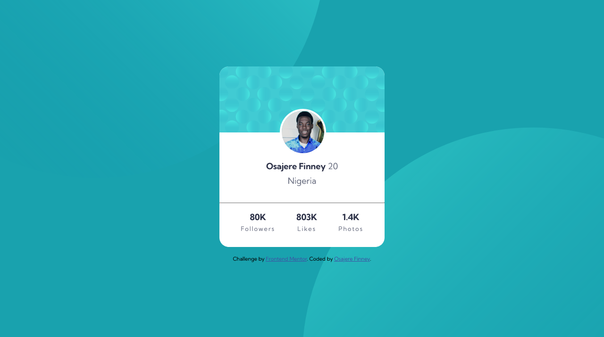

# profile-card-component
# Frontend Mentor - Profile card component solution

This is a solution to the [Profile card component challenge on Frontend Mentor](https://www.frontendmentor.io/challenges/profile-card-component-cfArpWshJ). Frontend Mentor challenges help you improve your coding skills by building realistic projects. 

## Table of contents

- [Overview](#overview)
  - [The challenge](#the-challenge)
  - [Screenshot](#screenshot)
  - [Links](#links)
- [My process](#my-process)
  - [Built with](#built-with)
  - [What I learned](#what-i-learned)
  - [Continued development](#continued-development)
  - [Useful resources](#useful-resources)
- [Author](#author)
- [Acknowledgments](#acknowledgments)

## Overview

### The challenge

- Build out the project to the designs provided

### Screenshot

### Links

- Solution URL: [Solution link](https://finney06.github.io/profile-card-component/)
- Live Site URL: [Live Site Solution link](https://finney06.github.io/profile-card-component/)

## My process

### Built with

- Semantic HTML5 markup
- CSS custom properties
- Flexbox

### What I learned

I learnt how to center cards in different ways,was also able to position the profile picture on top of the background card and also learnt how to position background SVG images as you want and can be linked in the css code instead of using html img reference.

### Continued development

I would like to take more of frontend mentor's challenges pertaining with HTML and CSS to improve my coding skills with HTML and most especially CSS. 

### Useful resources

- [Stack Overflow](https://stackoverflow.com/questions/72167149/why-is-justify-content-center-of-my-css-code-not-working) - This helped me to understand how to center the card in different ways. I really liked this pattern and will use it going forward.
- [Front-End Mentor](https://frontendmentor.slack.com/archives/CCYHFT85B/p1652445926488529) - 
I was able to correct some minor errors in my coding so it will be easy for screen reader to understand my code.

## Author

- Frontend Mentor - [@Finney06](https://www.frontendmentor.io/profile/Finney06)
- Twitter - [@Osa_finney](https://www.twitter.com/@Osa_finney)

## Acknowledgments

I would like to acknowledge the people that answered my questions on stark Overflow and Mrs Grace from Slack for helping me out in some few corrections in my code and helped me properly alighned my background image as given in the design.

